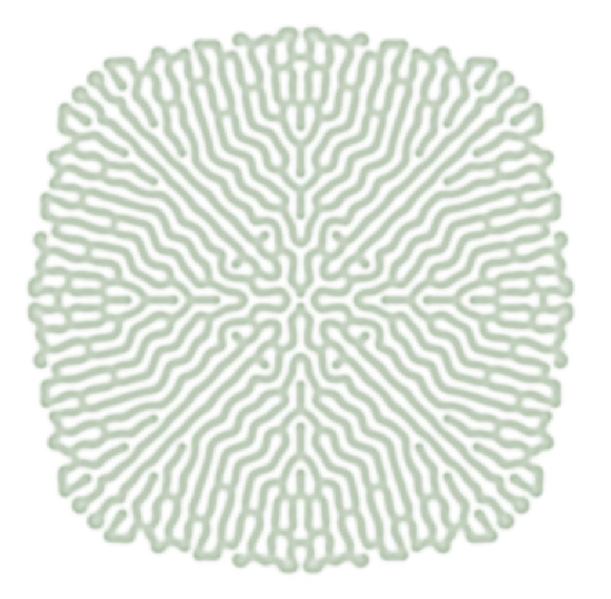
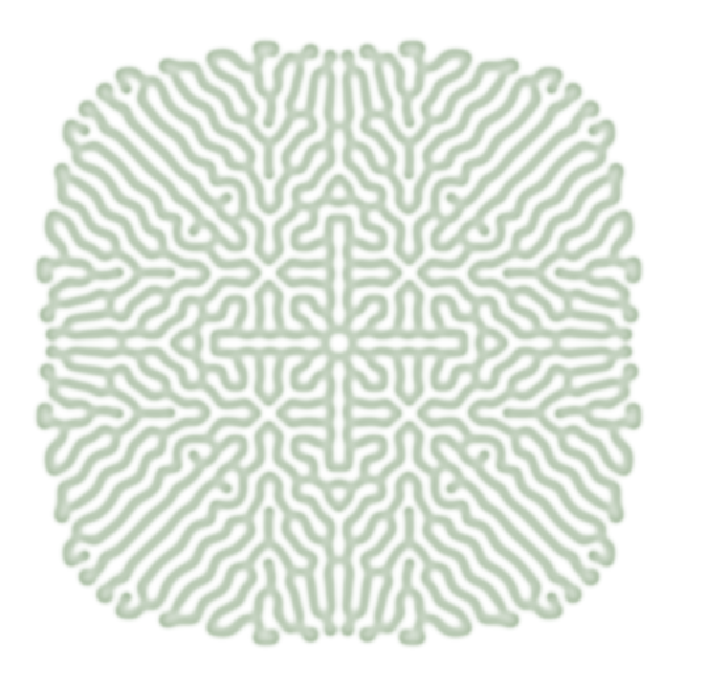
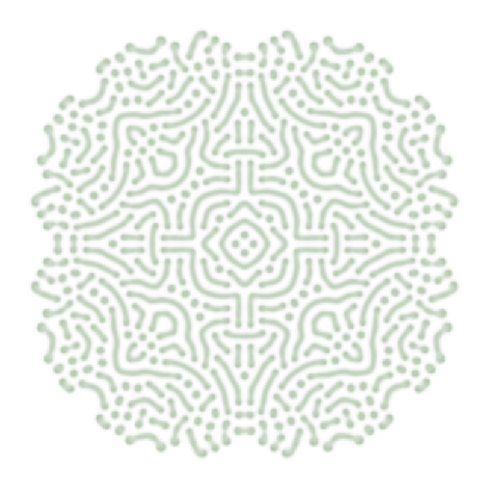
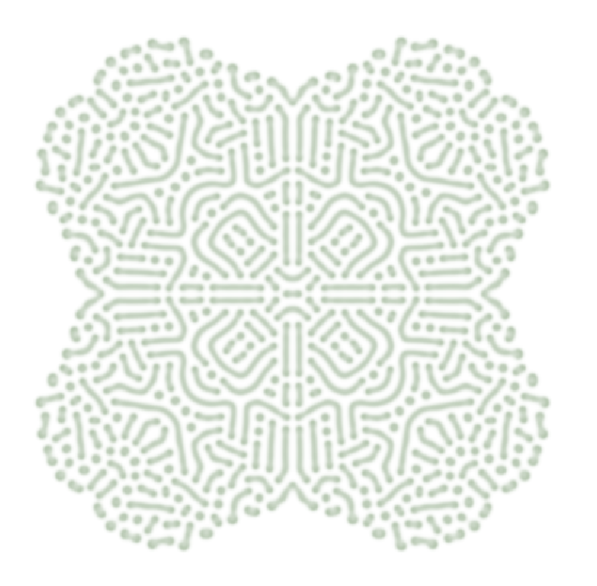
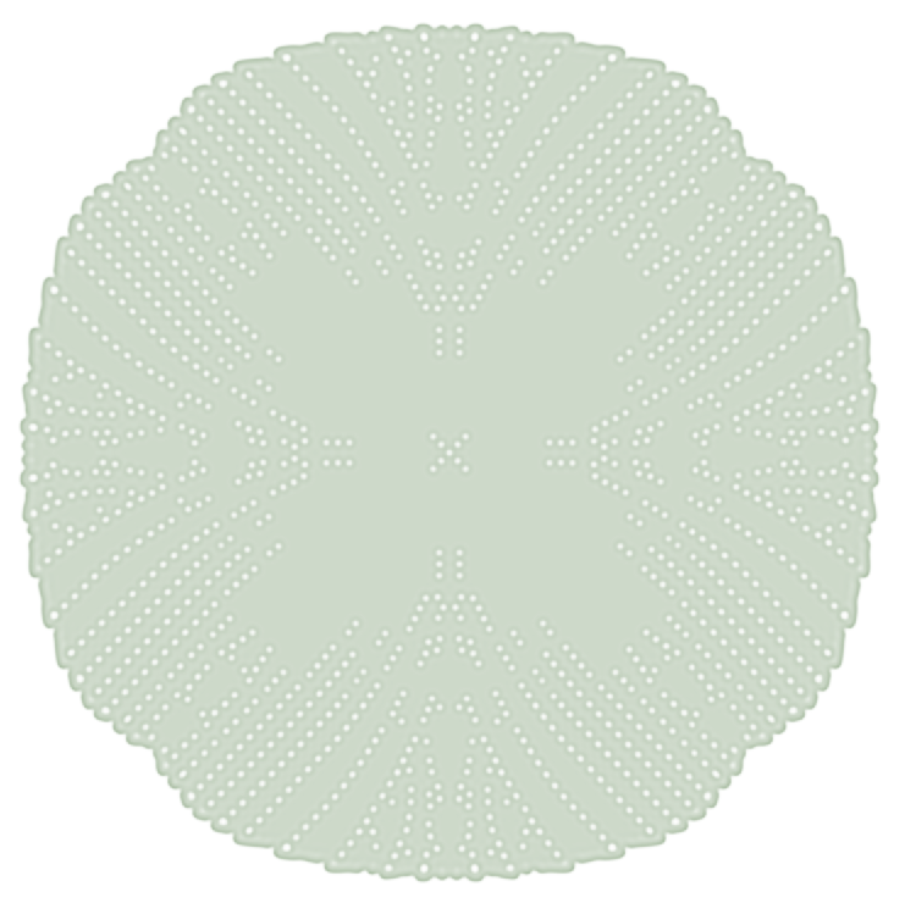

# Gray-Scott Experiments

### Coral

*Image Settings:*  
rows = 300  
columns = 300  

#### Parameters

diffusion_a = 0.2  
diffusion_b = 0.1  
feed_rate = 0.055  
kill_rate = 0.062  

seed_a = 0.0  
seed_b = 1.0  
seed_size = 3x3 cells  

#### Notes
Branching coral-like ridges with eightfold radial symmetry.

---

### Totem

*Image Settings:*  
rows = 300  
columns = 300  

#### Parameters

diffusion_a = 0.2  
diffusion_b = 0.1  
feed_rate = 0.035  
kill_rate = 0.062  

seed_a = 0.0  
seed_b = 1.0  
seed_size = 3x3 cells  

#### Notes
Glyph-like radial pattern composed of curved segments and scattered circular nodes.

 

## Four-Seed Convergence

Adding four evenly spaced seeds near the center of the simulation, I expected the resulting patterns to collide chaotically.

Instead, as the four growing regions converged, they appeared to slow or halt just before making contact. They then continued expanding inward toward the center while remaining separated.

Once the central space filled in, the pattern continued expanding outward much like the original one-seed version, as though the four seeds had been parts of one organism all along.

  
   
  

  <em>Coral: Single-seed (left) and four-seed (right) initialization.</em>

 

  
   
  

  <em>Totem: Single-seed (left) and four-seed (right) initialization.</em>

### Cipher

*Image Settings:*  
rows = 1201  
columns = 1201  

#### Parameters

diffusion_a = 0.2  
diffusion_b = 0.1  
feed_rate = 0.05  
kill_rate = 0.06  

seed_a = 0.0  
seed_b = 1.0  
seed_size = 3x3 cells  

#### Notes
A porous circular form with clustered openings, resembling an encoded symbol or unfamiliar signal.
